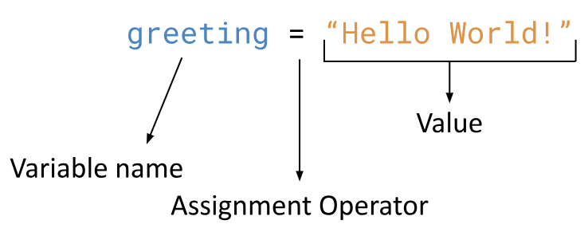
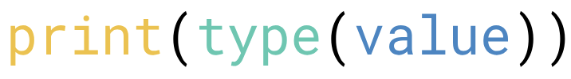

# 3.2 Variables & Data Types

## Success Criteria
- [x] I can differentiate between Strings, integers, and floats in Python
- [x] I can initialize variables in Python
- [x] I can use the type() function to find the data type of a value and a variable

## Data Types

### String (str)
>- `str` is short for String
>- A `str` contains text, or a sequence of zero or more characters (this includes numbers, letters, punctuation, spaces - basically anything you can type on screen with your keyboard)
>- Strings must be enclosed or surrounded by **single** *or* **double** quotes

#### <ins>```Examples:```</ins>
-
- 
- 

### Integer (int)
>- `int` is short for integer
>- An `int` contains a **positive** or **negative** whole number *or* **zero** (It is the same as how we define integer in math)
>- It cannot have a decimal

#### <ins>```Examples:```</ins>
- 
-
-

### float
>-  `float` is short for Floating-point number
>- Think of this as decimal numbers in math. 
>- In Computer Science, a `float` is an **integer that has a decimal component**.

#### <ins>```Examples:```</ins>
- 
-
-

## Variables
Variables are a fundamental aspect in pretty much every programming languages.
Variables are used to store information in a program so that it can be used later.

#### A variable has 4 things:
- Name
- Data Type
- Assignment Operator (represented by `=`)
- Value

```Initializing a variable:```


```
Notice that the data type is not shown in the picture above. Python knows what the data type will be based on what is stored in the variable. (e.g. If Python sees a string in the variable, it automatically knows that it is a string and stores this information in the background)
```

<ins>```EXAMPLE #1:```</ins>``` Identify the 4 parts of variables using the following code```
```python
greeting = "Hello World!"
```
- Name: 
- Type: 
- Assignment Operator: = 
- Value: 

<ins>```EXAMPLE #2:```</ins> ``` Identify the 4 parts of variables using the following code```
```python
my_number = 50
```
- Name: 
- Type: 
- Assignment Operator: = 
- Value: 

### Using Variables

#### <ins>```EXAMPLE #1:```</ins>```Type this code into Lesson.py and run the program. What does it output?```
```python
greeting = "Hello World!"

print(greeting)
```
In the above example, we are storing the value `"Hello World!"` inside a variable that we named `greeting`. Then, we printed `greeting`, which will print the value that is stored inside the `greeting` variable.

#### <ins>```EXAMPLE #2:```</ins> ```What do you think this program will output? Type it into Lesson,py and run the program to check your answer.```
```python
my_number = 50

print(my_number)
```

### Finding Out the Type
To find the data type of a value or variable, we need to use the `type()` function:



Inside the brackets for the `type()` function, we can put the value or a variable that we want to find the type for.

<ins>```EXAMPLE #1:```</ins>```Type this code into Lesson.py and run the program. What does it output?```
```python
print(type(50.0))
```
Output: 

<ins>```EXAMPLE #2:```</ins>```Type this code into Lesson.py and run the program. What does it output?```
```python
my_number = 50

print(type(my_number))
```
Output: 

```
Notice the difference in the data types between 50 and 50.0. In math, we would consider this to both be integers. However, in Computer Science, 
- `50` is an `int`
- `50.0` is a `float`
```